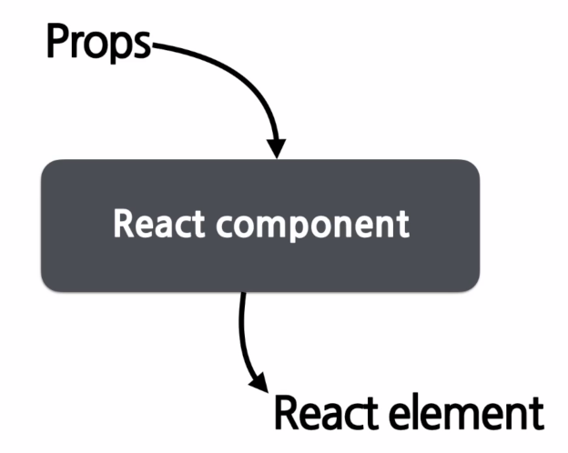

### Components
- 리액트는 모든 페이지가 컴포넌트로 구성
- 하나의 컴포넌트는 여러개의 컴포넌트의 조합으로 구성될 수 있음
- 컴포넌트 이름은 항상 대문자로 시작 (소문자는 태그로 인식함)
- props (속성)을 입력받아서 그에 맞는 리액트 엘리먼트를 리턴해주는 역할
    
- 모든 리액트 컴포넌트는 Props를 직접 바꿀 수 없고, 같은 Props에 대해서는 항상 같은 결과를 보여줌
- Component는 Function Component, Class Component로 나뉨
- Function Component를 개선하면서 Hook이라는 개념이 나옴

#### Function Component
- 간단한 함수 형태를 가짐
```js
function Welcome(props) {
    return <h1>Hello</h1>;
}
```

#### Class Component
- es6의 클래스를 사용해서 만든 컴포넌트
- React.Component를 상속받아서 만듦
```js
// 위의 Function Component예제와 동일한 역할을 하는 컴포넌트
class Welcome extends React.Component {
    render() {
        return <h1>Hello</h1>;
    }
}
```

### Props
- 리액트 컴포넌트의 속성
- 컴포넌트에 전달할 다양한 정보를 담고 있는 자바스크립트 객체

#### Props 특징
- Readonly - 값을 변경할 수 X
- 변경해야하는 경우 새로 생성 후 재 랜더링

#### Props 사용법
ex.
```js
// JSX에서 props 사용
function App(props) {
    return (
        <Profile
            name="Hyein"
            introduction="안녕하세요."
            viewCnt={1000}
        />
    );
}
// 이렇게 넘겨주면 Profile 컴포넌트의 props로 
// name, introduction, viewCnt가 넘어감
```

```js
// JSX를 사용하지 않는 경우
React.createElement(
    Profile,
    {
        name:"Hyein",
        introduction: "안녕하세요.",
        viewCnt: 1000   
    },
    null
);
```