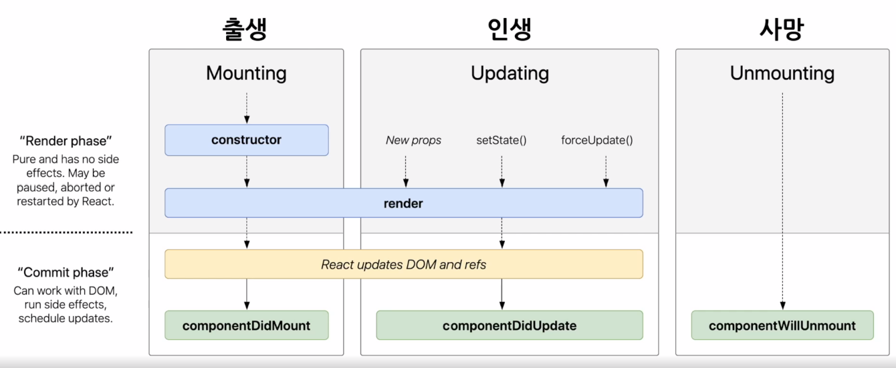

### State
- 리액트 컴포넌트의 상태 (데이터)
- == 리액트 컴포넌트의 변경 가능한 데이터를 State라 함
- State가 변경될 경우 컴포넌트가 재렌더링되기 때문에 렌더링과 데이터 흐름에 관련없는 값을 포함하면 컴포넌트가 다시 렌더링되어 성능을 저하시킬 수 있음
--> 렌더링이나 데이터 흐름에 사용되는 값만 state에 포함시켜야 함
- 렌더링이나 데이터 흐름에 사용되지 않는 값은 컴포넌트의 인스턴스 필드에 포함시키면 됨
- JavaScript 객체 형태
- state는 정의 후 직접 수정할 수 없음 (setState함수를 통해 수정)

ex.
```js
class LikeButton extends React.Component {
    constructor(props) {
        super(props);

        this.state = {
            liked: false
        };3
    }
}
```

### LifeCycle
- class component의 기능 (class Component는 지금은 거의 사용되지 않음)
- mount이후 componentDidMount() 실행
- props변경, setState(), forceUpdate에 의해 update되는 경우 재 render 
- render 종료 후 componentDidUpdate() 실행
- unmount직전 componentWillUnmount() 실행
